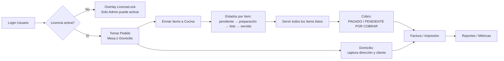
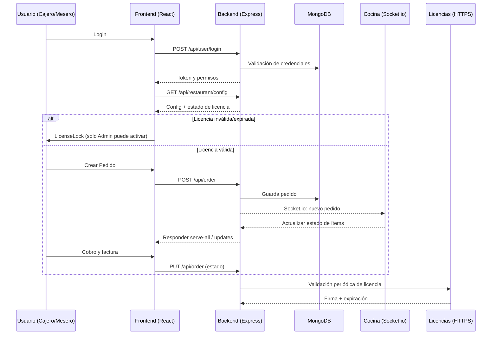
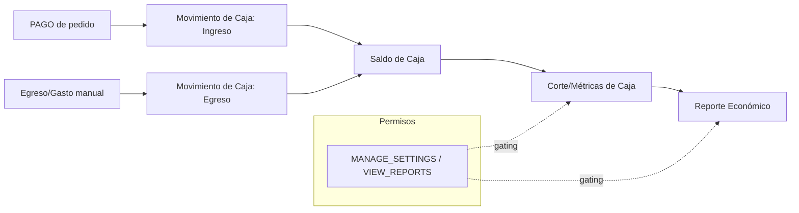

# 🍽️ Informe Técnico y Manual de Operación: Restaurantes LunIA

## 1. Introducción
**Restaurantes LunIA** es una solución integral de Punto de Venta (POS) diseñada específicamente para optimizar la operación de restaurantes, cafeterías y negocios gastronómicos. El sistema utiliza una arquitectura moderna, escalable y segura, permitiendo la gestión en tiempo real de pedidos, mesas, inventarios y domicilios.

---

## 2. Funcionalidades del Sistema

### 🛒 Gestión de Pedidos (POS)
- **Interfaz Intuitiva**: Diseñada para una toma de pedidos rápida con soporte para categorías y productos.
- **Modos de Servicio**: 
  - **Comedor (Dine-In)**: Gestión por mesas.
  - **Domicilios (Delivery)**: Flujo especializado para pedidos externos con captura de dirección y datos del cliente.
- **Personalización**: Capacidad de añadir notas a los platos y gestionar cantidades de forma dinámica.
- **Facturación Profesional**: Generación de recibos detallados con estado de pago (PAGADO / PENDIENTE POR COBRAR).

### 🪑 Gestión de Mesas
- **Mapa de Mesas**: Visualización en tiempo real del estado de las mesas (Libre, Ocupada, Reservada).
- **Acciones Rápidas**: Reasignación de mesas, cancelación de pedidos y visualización de cuentas activas.

### 🛵 Módulo de Domicilios
- **Flujo Independiente**: Los domicilios no bloquean mesas físicas.
- **Información de Entrega**: Registro detallado de dirección y cliente en la factura para el domiciliario.
- **Filtros de Órdenes**: Vista especializada para rastrear pedidos de entrega.

### 📊 Dashboard y Reportes
- **Métricas en Tiempo Real**: Visualización de ingresos diarios, productos más vendidos y horas pico.
- **Reportes Económicos**: Análisis detallado de ventas por periodo.
- **Panel de Control**: Gestión de categorías, platos y configuración del restaurante.

---

## 3. Arquitectura Técnica (Nivel Profesional)

El sistema opera bajo un stack **MERN** (MongoDB, Express, React, Node.js) y está completamente **Dockerizado** para garantizar aislamiento y portabilidad.

### Infraestructura de Contenedores
1. **Frontend**: Aplicación React servida mediante un servidor **Nginx** optimizado.
2. **Backend**: API REST en Node.js que gestiona la lógica de negocio y comunicaciones vía Socket.io.
3. **Base de Datos**: Instancia de **MongoDB 6.0** dedicada por restaurante.
4. **Proxy Global (Traefik)**: Gestiona el tráfico HTTPS y los certificados SSL automáticamente.

---

## 4. Guía de Instalación y Despliegue

### Requisitos Previos
- Servidor con Linux (Ubuntu recomendado) o Windows.
- Docker y Docker Compose instalados.
- Un dominio o subdominio apuntando a la IP del servidor.

### Paso 1: Configuración de Infraestructura Global
Antes de instalar el primer restaurante, se debe levantar el proxy central:
1. Navegar a la carpeta `infrastructure/`.
2. Ejecutar `docker network create proxy-public`.
3. Iniciar el proxy: `docker compose up -d`.

### Paso 2: Despliegue de una Instancia (Restaurante)
1. Copiar los archivos del proyecto a una carpeta (ej: `/opt/restaurante-luna`).
2. Crear y configurar el archivo `.env` basándose en `.env.example`:
   ```env
   EMPRESA_ID=luna_pos
   DOMAIN=luna.tudominio.com
   LICENSE_KEY=tu_licencia_aqui
   ```
3. Iniciar el stack: `docker compose up -d`.

---

## 5. Mantenimiento y Seguridad

### 🛡️ Aislamiento de Datos
Cada restaurante es un "stack" independiente. Los datos de un restaurante nunca se mezclan con otros, incluso si están en el mismo servidor físico.

### 💾 Backups Automáticos
El sistema incluye un servicio de respaldo que:
- Realiza un volcado de la base de datos cada 24 horas.
- Almacena los respaldos en la carpeta `./backups` del host.
- Mantiene un historial de los últimos 7 días.

### 🔄 Sistema de Actualizaciones
Para actualizar el sistema sin perder datos:
1. Ejecutar el script profesional: `bash update.sh`.
2. El script realizará un backup preventivo, descargará las mejoras y reiniciará los servicios automáticamente.

### 📈 Monitoreo
El administrador puede supervisar la salud del sistema mediante:
- **Uptime Kuma**: Estado de disponibilidad de las instancias (`status.tudominio.com`).
- **Dozzle**: Visualización de logs en tiempo real (`logs.tudominio.com`).

---

## 6. Soporte y Licenciamiento
El backend realiza validaciones periódicas contra el servidor central de licencias de LunIA para garantizar la legitimidad del software y habilitar funciones premium.

---
**Elaborado por:** LunIA  
**Fecha:** 11 de febrero de 2026  
**Versión:** 1.2.0-Dockerized

---

## 7. Funcionalidades Detalladas (Ampliación)

### Usuarios, Roles y Permisos
- Autenticación con JWT (cookies httpOnly) y verificación por middleware.
- Roles: Admin, Cajero, Mesero (configurable).
- Permisos granulares (ejemplos): MANAGE_MENU, VIEW_REPORTS, MANAGE_SETTINGS, MANAGE_INVENTORY, CREATE_ORDERS.
- Gateo de UI y de rutas backend por permisos/rol.

### Menú y Categorías
- CRUD de categorías y platos con imágenes (subidas vía `/api/upload`).
- Campo “requiere preparación” para controlar flujo en cocina.

### Cocina y Estado de Ítems
- Seguimiento por ítem: pendiente, en preparación, listo, servido.
- Acción “Servir todos los ítems listos” para agilizar el despacho.

### Inventario y Proveedores
- Inventario: movimientos de entrada/salida vinculados a ítems del menú.
- Proveedores: CRUD y relación con movimientos de inventario.

### Caja y Cortes
- Movimientos de caja (ingresos/egresos) con categorías.
- Cortes y métricas de caja en reportes/metrics.

### Reportes y Métricas
- Reporte de rendimiento (horas pico, platillos populares).
- Reporte económico (ventas por periodo, totales).
- Métricas para Dashboard (ingresos del día, top productos, etc.).

### Domicilios (Delivery)
- Flujo independiente del comedor; captura de datos del cliente y dirección.
- Factura con detalles de entrega para el domiciliario.

### Licenciamiento Profesional
- Licencia centralizada en el servidor (no en cada dispositivo).
- Activación restringida a Admin/permiso MANAGE_SETTINGS.
- Validación programada y modo offline con período de gracia.
- Aviso de vencimiento configurable y bloqueo cuando expira.

---

## 8. Flujo de Operación
- Login: el usuario accede según rol y permisos.
- Pedido: selección de mesa o domicilio, añadidos y notas.
- Cocina: el personal ve ítems pendientes/en preparación/listos.
- Servicio: “servir” por ítem o “servir todos listos” por orden.
- Cobro: actualización de estado PAGADO / PENDIENTE POR COBRAR.
- Reportes: consulta de métricas y exportables (según permisos).
- Inventario: registrar entradas/salidas y asociar proveedor cuando aplica.

---

## 9. SSL y HTTPS

### Opción Recomendada: Traefik (Automática con Let’s Encrypt)
1. Configurar dominio DNS apuntando al servidor.
2. Editar `infrastructure/traefik.yml`: correo en `acme.email`.
3. Crear archivo de estado de certificados:
   - Linux:
     ```bash
     cd infrastructure
     touch acme.json
     chmod 600 acme.json
     ```
   - Windows (PowerShell):
     ```powershell
     cd infrastructure
     New-Item -ItemType File acme.json
     # En Windows no se usa chmod; Traefik manejará permisos dentro del contenedor
     ```
4. Levantar el proxy global:
   ```bash
   docker network create proxy-public
   docker compose -f infrastructure/docker-compose.yml up -d
   ```
5. Desplegar el stack del restaurante con `docker-compose.yml`. Traefik emitirá automáticamente el certificado para `${DOMAIN}`.

### Opción Local/Desarrollo: Certificado Autogenerado (Self-signed)
- OpenSSL:
  ```bash
  openssl req -x509 -nodes -days 365 -newkey rsa:2048 \
    -keyout key.pem -out cert.pem -subj "/CN=localhost"
  ```
- mkcert (Windows/macOS/Linux):
  ```bash
  mkcert -install
  mkcert localhost
  ```
- Uso en desarrollo (si desea HTTPS local con Vite):
  ```bash
  npx vite --https --cert ./localhost.pem --key ./localhost-key.pem
  ```
  Nota: En producción el HTTPS lo gestiona Traefik; el backend y frontend corren detrás del proxy.

---

## 10. Configuración por Entorno (.env)
Backend ([config.js](file:///d:/code/restaurante%20mongodb/Restaurant_POS_System/pos-backend/config/config.js)):
```env
PORT=3000
MONGODB_URI=mongodb://localhost:27017/pos-db
NODE_ENV=production
JWT_SECRET=clave_segura
LICENSE_SERVER_URL=https://licencias.tudominio.com/api/licenses
LICENSE_LOCAL_SECRET=sal_local_segura
```
Frontend:
```env
VITE_API_URL=/api
```
Docker Compose del restaurante ([docker-compose.yml](file:///d:/code/restaurante%20mongodb/Restaurant_POS_System/docker-compose.yml)):
```env
EMPRESA_ID=luna_pos
DOMAIN=luna.tudominio.com
LICENSE_KEY=XXXX-XXXX-XXXX-XXXX
JWT_SECRET=clave_segura
LICENCIAS_URL=https://licencias.tudominio.com/api/licenses
```

---

## 11. Comandos Útiles
- Backend dev: `npm run dev` en [pos-backend](file:///d:/code/restaurante%20mongodb/Restaurant_POS_System/pos-backend/package.json)
- Backend start: `npm start`
- Frontend dev: `npm run dev` en [pos-frontend](file:///d:/code/restaurante%20mongodb/Restaurant_POS_System/pos-frontend/package.json)
- Frontend build: `npm run build` y `npm run preview`
- Docker stack: `docker compose up -d` / `docker compose down`
- Logs: `docker logs -f pos-backend-<EMPRESA_ID>` / `docker logs -f pos-frontend-<EMPRESA_ID>`
- Proxy global: `docker compose -f infrastructure/docker-compose.yml up -d`

---

## 12. Solución de Problemas
- Certificados no se emiten: verificar DNS, `acme.email`, y que Traefik esté en `proxy-public`.
- CORS/Socket.io: el proxy Nginx del frontend incluye reglas para `/api` y `/socket.io`.
- Licencia “no válida”: asegure que `LICENSE_SERVER_URL` apunte al servicio real HTTPS y que el servidor de licencias firme respuestas correctamente.
- Bloqueo por licencia: solo Admin puede activar/renovar desde la UI. Usuarios no Admin verán aviso informativo.
- Base de datos: ver volumen `mongodb_data`; revise contenedor `mongodb` y conectividad desde backend.

---

**Actualizado por:** LunIA  
**Fecha de actualización:** 12 de febrero de 2026  
**Versión del documento:** 1.3.0

---

## 13. Diagramas (Mermaid)

### Arquitectura del Sistema

```mermaid
graph TD
  subgraph Cliente
    B[Browser / React]
  end

  subgraph Proxy Global
    T[Traefik<br/>TLS/HTTPS<br/>Let's Encrypt]
  end

  subgraph Restaurante (Stack)
    N[Nginx<br/>Frontend Build] -->|/api, /socket.io| E[Express API<br/>Socket.io]
    E --> M[(MongoDB 6.0)]
    E --> U[Uploads (static)]
  end

  B -->|HTTPS| T
  T -->|Ruta: DOMAIN| N

  %% Servidor de Licencias externo
  L[Servidor de Licencias<br/>HTTPS] -. validación .-> E

  %% Redes
  classDef net fill:#eef,stroke:#99f,stroke-width:1px,color:#333;
  class T net
  class N,E,M net
```

### Flujo de Pedido (Resumen)



### Secuencia (Detalle técnico)



### Exportar Diagramas (Opcional)
- Instalar mermaid-cli:
  - `npm i -g @mermaid-js/mermaid-cli`
- Exportar:
  - `mmdc -i arquitectura.mmd -o arquitectura.svg`
  - `mmdc -i flujo-pedido.mmd -o flujo-pedido.svg`
  - `mmdc -i inventario.mmd -o inventario.svg`
  - `mmdc -i caja.mmd -o caja.svg`

### Inventario y Proveedores

```mermaid
flowchart TB
  subgraph Catálogo
    I[Ítem del Menú]
    Prep{¿Requiere preparación?}
    I --> Prep
  end

  subgraph Proveedores
    S[Proveedor]
  end

  S --> ME[Movimiento de Inventario: Entrada]
  ME -->|stock += cantidad| I

  subgraph Pedido
    P[Agregar ítem al pedido]
  end

  Prep -- No --> SO[Salida automática de stock]
  SO -->|stock -= cantidad| I
  P --> SO

  Prep -- Sí --> K[Cocina (flujo de preparación)]
  P --> K

  I --> A[Disponibilidad en Menú]
  A --> F{¿Stock suficiente?}
  F -- No --> B[Bloquear agregar / avisar sin stock]
  F -- Sí --> P
```

### Caja y Cortes


